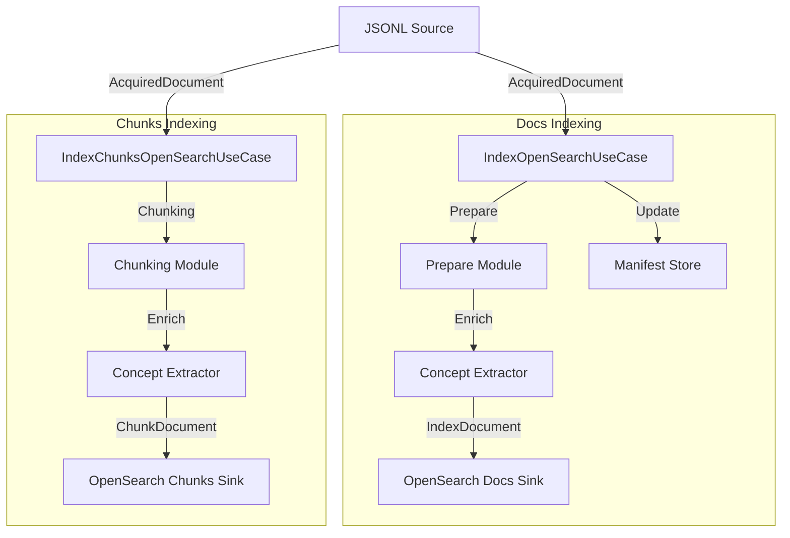

# Análisis de Módulos SRI Implementados (Master)

Este documento resume los dos primeros módulos del sistema de recuperación de información clínica implementados en la rama `master`: **Acquisition** (Módulo 1) e **Indexing** (Módulo 2). Se detallan sus salidas, estrategias utilizadas y posibles mejoras para la implementación del módulo vectorial.

---

## 📑 Índice

- [Resumen Ejecutivo](#resumen-ejecutivo)
- [Módulo 1: Acquisition](#módulo-1-acquisition)
  - [Objetivo](#objetivo)
  - [Arquitectura](#arquitectura)
  - [Estrategias Implementadas](#estrategias-implementadas)
  - [Salidas](#salidas)
  - [Modelos de Datos](#modelos-de-datos)
- [Módulo 2: Indexing](#módulo-2-indexing)
  - [Objetivo](#objetivo-1)
  - [Arquitectura](#arquitectura-1)
  - [Estrategias Implementadas](#estrategias-implementadas-1)
  - [Salidas](#salidas-1)
  - [Modelos de Datos](#modelos-de-datos-1)
- [Integración Entre Módulos](#integración-entre-módulos)
- [Recomendaciones para el Módulo Vectorial](#recomendaciones-para-el-módulo-vectorial)

---

## Resumen Ejecutivo

| Aspecto | Módulo 1 (Acquisition) | Módulo 2 (Indexing) |
|---------|------------------------|---------------------|
| **Entrada** | URLs semilla (seeds) | Archivos JSONL |
| **Salida** | Archivos JSONL (html.jsonl, pdf.jsonl) | Índices en OpenSearch |
| **Patrón** | Hexagonal (Ports & Adapters) | Hexagonal (Ports & Adapters) |
| **Tecnologías** | httpx, BeautifulSoup, pypdf | OpenSearch, SQLite, pyahocorasick |
| **Estrategia Principal** | BFS Crawler + Extraction | Doble Índice (Docs + Chunks) |

---

## Módulo 1: Acquisition

### Objetivo

Realizar web scraping y crawling de fuentes médicas estructuradas (HTML y PDF) para generar un corpus de documentos clínicos en formato JSONL.

### Arquitectura

```
┌──────────────────────────────────────────┐
│      AcquisitionService (Orquestador)    │
│  - Gestiona frontier (BFS crawler)       │
│  - Aplica filtros y políticas            │
│  - Coordina adaptadores                  │
└───────────────┬──────────────────────────┘
                │
    ┌───────────┴────────────────┐
    │                            │
    v                            v
┌─────────────┐          ┌──────────────┐
│   Ports     │          │  Adapters    │
│ (Interfaces)│          │(Implementa.) │
└─────────────┘          └──────────────┘
```

#### Puertos (Interfaces)

| Puerto | Responsabilidad |
|--------|-----------------|
| `HttpClient` | Descarga HTTP con redirects y SSL |
| `RobotsPolicy` | Validación de robots.txt |
| `HtmlExtractor` | Parseo HTML → título, secciones, links |
| `PdfExtractor` | Extracción de texto de PDFs |
| `JsonlSink` | Persistencia en formato JSONL |

#### Adaptadores

| Adaptador | Tecnología |
|-----------|------------|
| `HttpxClient` | httpx (HTTP moderno, async-ready) |
| `RobotsTxtPolicy` | urllib.robotparser |
| `SimpleHtmlExtractor` | BeautifulSoup + lxml |
| `SimplePdfExtractor` | pypdf |
| `JsonlFileSink` | Escritura JSONL a disco |

### Estrategias Implementadas

#### 1. Crawler BFS (Breadth-First Search)
- **Frontier**: Cola FIFO con `CrawlTask`
- **Control de profundidad**: `max_depth` configurable
- **Deduplicación por URL**: Set de URLs visitadas
- **Deduplicación por contenido**: SHA256 hash del body

#### 2. Políticas de Filtrado
```python
# Flujo de decisión
url → normalizar → ¿visitado? → ¿denylist? → ¿whitelist? → ¿robots.txt? → fetch
```

- **Whitelist de dominios**: Solo se procesan URLs de dominios permitidos
- **Denylist**: Patrones de URL excluidos (índices, términos de uso, etc.)
- **Robots.txt**: Respeto ético del crawling

#### 3. Extracción Estructurada de HTML
- **Título**: Prioridad `og:title` > `<title>` > `<h1>`
- **Secciones**: Agrupación por headings (`<h1>`, `<h2>`, `<h3>`)
- **Links**: Extracción de `href` para expandir frontier
- **Metadatos**: Idioma, autor, fechas

#### 4. Política de Persistencia
```python
def should_persist(doc: dict) -> bool:
    # Filtros:
    # - Longitud mínima de body
    # - No es página de índice
    # - Tiene contenido significativo
```

#### 5. Politeness
- **Delay por dominio**: Configurable (`per_domain_delay_s`)
- **User-Agent**: Identificación clara del bot

### Salidas

#### Formato JSONL
Cada línea es un documento JSON con la siguiente estructura:

```json
{
  "doc_id": "slug-o-hash-unico",
  "url": "https://fuente.med/articulo",
  "source_domain": "fuente.med",
  "fetched_at": "2026-03-01T10:30:00Z",
  "content_hash": "sha256...",
  "crawl": {
    "depth": 1,
    "parent_url": "https://fuente.med/index",
    "seed_id": "seed_001",
    "seed_group": "cardiologia"
  },
  "content": {
    "mime_type": "text/html",
    "title": "Insuficiencia Cardíaca - Guía Clínica",
    "body": "Texto completo del documento...",
    "sections": [
      {"heading": "Definición", "text": "..."},
      {"heading": "Etiología", "text": "..."},
      {"heading": "Tratamiento", "text": "..."}
    ]
  },
  "page_meta": {
    "language": "es",
    "author": "Dr. García",
    "published_at": "2025-01-15",
    "updated_at": "2025-06-20"
  }
}
```

#### Archivos Generados
- `data/acquisition/html.jsonl` - Documentos HTML
- `data/acquisition/pdf.jsonl` - Documentos PDF

### Modelos de Datos

#### CrawlTask
```python
@dataclass(frozen=True)
class CrawlTask:
    url: str
    depth: int
    parent_url: Optional[str]
    seed_id: str
    seed_group: str
```

#### FetchResult
```python
@dataclass(frozen=True)
class FetchResult:
    url: str
    status_code: int
    mime_type: str
    content: bytes
    fetched_at: datetime
    headers: dict[str, str]
```

#### Section
```python
@dataclass(frozen=True)
class Section:
    heading: str
    text: str
```

---

## Módulo 2: Indexing

### Objetivo

Procesar documentos adquiridos y cargarlos en OpenSearch utilizando una estrategia de **doble índice**: documentos completos + fragmentos (chunks) optimizados para búsqueda vectorial.

### Arquitectura



#### Puertos (Interfaces)

| Puerto | Responsabilidad |
|--------|-----------------|
| `DocumentSourcePort` | Iterar documentos de fuente |
| `ManifestStorePort` | Incrementalidad (evitar re-procesar) |
| `DocumentSinkPort` | Persistir en OpenSearch |

#### Adaptadores

| Adaptador | Tecnología |
|-----------|------------|
| `JsonlDocumentSource` | Lectura JSONL |
| `SqliteManifestStore` | SQLite para manifest |
| `OpenSearchIndexSink` | OpenSearch (docs completos) |
| `OpenSearchChunksSink` | OpenSearch (chunks + kNN) |

### Estrategias Implementadas

#### 1. Doble Índice
- **`clinical_docs_v1`**: Documentos completos (búsqueda léxica BM25)
- **`clinical_chunks_v1`**: Fragmentos (búsqueda vectorial kNN)

#### 2. Chunking de Dos Niveles

```python
# Nivel 1: Segmentación Clínica
for section in doc.sections:
    # Respeta secciones originales (Etiología, Tratamiento, etc.)
    
    # Nivel 2: Ventana con Overlap
    chunks = split_with_overlap(
        section.text,
        max_chars=1200,
        overlap_chars=200,
        min_chars=100
    )
```

**Características:**
- **Cohesión temática**: No mezcla contenido de secciones diferentes
- **Corte inteligente**: Busca espacios en blanco para no cortar palabras
- **Trazabilidad completa**: `doc_id`, `section_index`, `chunk_index`, offsets

#### 3. Extracción de Conceptos Médicos

```python
# Usa Aho-Corasick para matching eficiente
LEXICON_ES = {
    "DISNEA": ["disnea", "dificultad respiratoria", "falta de aire"],
    "FIEBRE": ["fiebre", "temperatura alta", "hipertermia"],
    # ... más conceptos
}

# Normalización previa
text_norm = normalize_text(text)  # lowercase + strip_accents
concept_ids = extractor.extract(text_norm)  # ["DISNEA", "FIEBRE", ...]
```

#### 4. Pipeline de Texto

```python
@dataclass(frozen=True)
class TextPipelineConfig:
    lowercase: bool = True
    strip_accents: bool = True
    remove_stopwords: bool = True
    min_token_len: int = 2
    max_token_len: int = 40
```

**Funcionalidades:**
- Normalización Unicode (NFKC)
- Eliminación de caracteres de control
- Detección de idioma (heurística por stopwords)
- Tokenización inteligente (preserva "covid-19", "hba1c")

#### 5. Incrementalidad con Manifest

```python
# Evita reprocesar documentos sin cambios
prev = manifest.get(doc_id)
if prev.content_hash == current_hash and prev.pipeline_version == PIPELINE_VERSION:
    skip()  # Ya procesado con misma versión
```

### Salidas

#### Índice de Documentos (`clinical_docs_v1`)

**Mapping OpenSearch:**
```json
{
  "properties": {
    "url": {"type": "keyword"},
    "source_domain": {"type": "keyword"},
    "fetched_at": {"type": "date"},
    "title": {"type": "text", "analyzer": "folding_analyzer"},
    "body": {"type": "text", "analyzer": "folding_analyzer"},
    "sections_text": {"type": "text", "analyzer": "folding_analyzer"},
    "language": {"type": "keyword"},
    "content_hash": {"type": "keyword"},
    "word_count": {"type": "integer"},
    "concept_ids": {"type": "keyword"}  // Array de conceptos
  }
}
```

#### Índice de Chunks (`clinical_chunks_v1`)

**Mapping OpenSearch con kNN:**
```json
{
  "settings": {
    "index.knn": true
  },
  "properties": {
    "chunk_id": {"type": "keyword"},
    "doc_id": {"type": "keyword"},
    "section_heading": {"type": "keyword"},
    "chunk_text": {"type": "text", "analyzer": "folding_analyzer"},
    "concept_ids": {"type": "keyword"},
    "embedding": {
      "type": "knn_vector",
      "dimension": 768,
      "method": {
        "name": "hnsw",
        "space_type": "l2",
        "engine": "nmslib",
        "parameters": {
          "ef_construction": 128,
          "m": 16
        }
      }
    }
  }
}
```

#### Reportes de Indexación

```json
{
  "timestamp": "2026-03-03T15:30:00",
  "docs_seen": 1500,
  "docs_skipped_same_hash": 200,
  "docs_sent_to_index": 1300,
  "docs_indexed_ok": 1298,
  "pipeline_version": "1.0.0",
  "errors_count": 2,
  "stats": {
    "by_mime": {"text/html": 1200, "application/pdf": 300},
    "by_domain": {"medlineplus.gov": 500, "msdmanuals.com": 800}
  }
}
```

### Modelos de Datos

#### AcquiredDocument (Input)
```python
@dataclass(frozen=True)
class AcquiredDocument:
    doc_id: str
    url: str
    source_domain: str
    fetched_at: str
    crawl: CrawlMeta
    content: Content
    page_meta: Optional[PageMeta]
    content_hash: Optional[str]
```

#### IndexDocument (Output docs)
```python
@dataclass(frozen=True)
class IndexDocument:
    doc_id: str
    url: str
    title: str
    body: str
    sections_text: str
    content_hash: str
    word_count: int
    char_len: int
    concept_ids: List[str]  # Enriquecido
    # ... más campos
```

#### ChunkDocument (Output chunks)
```python
@dataclass(frozen=True)
class ChunkDocument:
    chunk_id: str           # {doc_id}:{section_index}:{chunk_index}
    doc_id: str
    section_heading: str
    section_index: int
    chunk_index: int
    start_char: int
    end_char: int
    chunk_text: str
    chunk_hash: str
    concept_ids: List[str]
    embedding: Optional[List[float]]  # Para módulo vectorial
```

---

## Integración Entre Módulos

```
┌─────────────────┐    JSONL    ┌─────────────────┐    OpenSearch
│   Acquisition   │ ──────────> │    Indexing     │ ──────────────>
│   (Módulo 1)    │             │   (Módulo 2)    │
└─────────────────┘             └─────────────────┘
                                        │
                                        v
                               ┌─────────────────┐
                               │  Módulo Vectorial │
                               │   (Por hacer)    │
                               └─────────────────┘
```

### Contrato JSONL

El módulo de Acquisition genera archivos JSONL que cumplen el schema `AcquiredDocument`. El módulo de Indexing:

1. Lee estos archivos con `JsonlDocumentSource`
2. Valida el schema con Pydantic/dataclasses
3. Transforma a `IndexDocument` o `ChunkDocument`
4. Persiste en OpenSearch

---

## Recomendaciones para el Módulo Vectorial

### 1. Aprovechar Infraestructura Existente

| Ya existe | Úsalo para |
|-----------|------------|
| `ChunkDocument.embedding` | Campo preparado para vector 768D |
| `opensearch_chunks_schema` | kNN ya configurado (HNSW/nmslib) |
| `ChunkingConfig` | Parámetros ajustables |
| `ConceptExtractor` | Enriquecimiento semántico |

### 2. Implementación Sugerida

```python
# src/sri_dx/modules/vector_store/embedding_service.py

class EmbeddingService:
    def __init__(self, model_name: str = "sentence-transformers/paraphrase-multilingual-MiniLM-L12-v2"):
        self.model = SentenceTransformer(model_name)
    
    def embed_chunks(self, chunks: Iterable[ChunkDocument]) -> Iterable[ChunkDocument]:
        for chunk in chunks:
            embedding = self.model.encode(chunk.chunk_text).tolist()
            yield replace(chunk, embedding=embedding)
```

### 3. Mejoras Posibles

#### Para Chunking
- **Chunking semántico**: Usar embedding similarity para decidir cortes
- **Chunks jerárquicos**: Parent document retrieval (guardar contexto expandido)
- **Metadata enrichment**: Agregar `section_type` (síntomas, tratamiento, etc.)

#### Para Conceptos
- **Expandir lexicon**: UMLS, SNOMED, o embeddings de conceptos médicos
- **Entity linking**: Conectar conceptos a ontologías estándar
- **Concept weighting**: TF-IDF sobre concept_ids

#### Para Embeddings
- **Modelos biomédicos**: `pritamdeka/BioBERT-mnli-snli-scinli-scitail-mednli-stsb`
- **Hybrid search**: Combinar BM25 léxico + kNN semántico
- **Cross-encoders**: Para re-ranking de resultados

### 4. Esquema de Búsqueda Híbrida Propuesto

```python
def hybrid_search(query: str, k: int = 20, alpha: float = 0.7):
    # 1. Búsqueda léxica (BM25)
    lexical_results = opensearch.search(
        index="clinical_chunks",
        body={"query": {"match": {"chunk_text": query}}}
    )
    
    # 2. Búsqueda vectorial (kNN)
    query_embedding = embed(query)
    vector_results = opensearch.search(
        index="clinical_chunks",
        body={"query": {"knn": {"embedding": {"vector": query_embedding, "k": k}}}}
    )
    
    # 3. Fusion (RRF o weighted)
    final_results = reciprocal_rank_fusion(lexical_results, vector_results, alpha)
    return final_results
```

### 5. Métricas a Implementar

| Métrica | Propósito |
|---------|-----------|
| NDCG@k | Calidad del ranking |
| MAP | Precisión promedio |
| MRR | Posición del primer resultado relevante |
| Recall@k | Cobertura de resultados |

---

## Archivos Clave de Referencia

### Módulo 1 (Acquisition)
- [src/sri_dx/modules/acquisition/service.py](src/sri_dx/modules/acquisition/service.py) - Orquestador
- [src/sri_dx/modules/acquisition/ports.py](src/sri_dx/modules/acquisition/ports.py) - Interfaces
- [src/sri_dx/adapters/scraping/](src/sri_dx/adapters/scraping/) - Implementaciones

### Módulo 2 (Indexing)
- [src/sri_dx/usecases/index_opensearch.py](src/sri_dx/usecases/index_opensearch.py) - Use case docs
- [src/sri_dx/usecases/index_chunks_opensearch.py](src/sri_dx/usecases/index_chunks_opensearch.py) - Use case chunks
- [src/sri_dx/modules/indexing/chunking.py](src/sri_dx/modules/indexing/chunking.py) - Lógica de chunking
- [src/sri_dx/modules/indexing/concepts/extractor.py](src/sri_dx/modules/indexing/concepts/extractor.py) - Extractor de conceptos

### Documentación
- [doc/dev/acquisition/acquisition.md](doc/dev/acquisition/acquisition.md)
- [doc/dev/indexing/00_overview.md](doc/dev/indexing/00_overview.md)
- [doc/dev/indexing/06_chunking_logic.md](doc/dev/indexing/06_chunking_logic.md)

---

*Documento generado automáticamente - Merge de master a features/setup-vectorial-bd*
