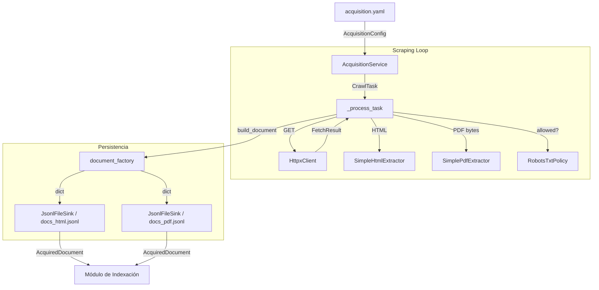

# Módulo de Adquisición y Scraping — Overview

El módulo de **Adquisición** es responsable de rastrear fuentes médicas en la web (HTML y PDF), extraer su contenido y persistirlo en archivos JSONL para su posterior indexación.

## Arquitectura

Sigue el patrón de **Arquitectura Hexagonal** (Ports & Adapters):

1. **Core (Schemas & Ports)**: Define qué es un documento adquirido y qué contratos deben cumplir las piezas de infraestructura.
2. **Módulo (`modules/acquisition/`)**: Toda la lógica de negocio del crawl — planificación de URLs, políticas de persistencia, limpieza de texto, construcción del documento final.
3. **Adapters (`adapters/scraping/`)**: Implementaciones concretas: cliente HTTP, extractores HTML/PDF, escritura JSONL, política de `robots.txt`.
4. **Script de entrada (`scripts/run_acquisition.py`)**: Punto de arranque que ensambla todas las piezas y ejecuta el servicio.

> **Nota sobre Use Cases**: El módulo actualmente no tiene un `RunAcquisitionUseCase` formal en `src/sri_dx/usecases/`. La lógica de orquestación vive directamente en `AcquisitionService`. Ver [04_service.md](04_service.md) para más detalle y la justificación de añadir un Use Case.

---

## Flujo de Datos

---

## Componentes Principales

| Componente | Ubicación | Responsabilidad |
|---|---|---|
| `AcquisitionConfig` | `modules/acquisition/schemas/` | Parámetros de crawl cargados desde YAML |
| `AcquisitionService` | `modules/acquisition/service.py` | Orquestador principal — scheduler + workers |
| `HttpxClient` | `adapters/scraping/http_client.py` | HTTP real con `httpx` |
| `RobotsTxtPolicy` | `adapters/scraping/robots_policy.py` | Cumplimiento de `robots.txt` |
| `SimpleHtmlExtractor` | `adapters/scraping/html_extractor.py` | Parser HTML con BeautifulSoup/lxml |
| `SimplePdfExtractor` | `adapters/scraping/pdf_extractor.py` | Extracción de texto de PDF con pypdf |
| `JsonlFileSink` | `adapters/scraping/jsonl_sink.py` | Escritura thread-safe de documentos JSONL |
| `document_factory` | `modules/acquisition/document_factory.py` | Construye el dict final del documento |
| `persist_policy` | `modules/acquisition/persist_policy.py` | Decide si un documento vale la pena guardar |

---

## Índice de Documentación

- [01_schemas.md](01_schemas.md): Modelos de datos.
- [02_ports.md](02_ports.md): Interfaces (Ports).
- [03_adapters.md](03_adapters.md): Adaptadores de infraestructura.
- [04_service.md](04_service.md): Lógica de orquestación.
- [05_config.md](05_config.md): Configuración detallada.
