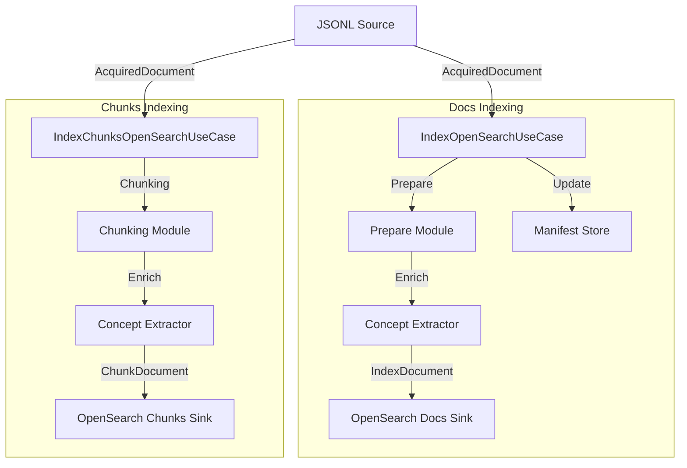

# Indexing Module Overview

El módulo de **Indexación** es responsable de procesar documentos adquiridos (HTML, PDF) y cargarlos en OpenSearch. El sistema utiliza una estrategia de **doble índice**: uno para documentos completos y otro para fragmentos (chunks) optimizado para búsqueda vectorial y RAG.

## Arquitectura

Sigue el patrón de **Arquitectura Hexagonal** (Ports & Adapters) para desacoplar la lógica de negocio de la infraestructura:

1.  **Core (Schemas & Ports)**: Define qué es un documento de índice y qué interfaces necesitan los Use Cases.
2.  **Use Cases**: Orquestan el flujo de indexación (lectura -> preparación -> enriquecimiento -> persistencia).
3.  **Adapters**: Implementaciones concretas de los puertos (OpenSearch para persistencia, SQLite para manifest de cambios, JSONL para lectura).
4.  **App**: Interfaz de usuario (CLI) para ejecutar los procesos.

## Flujo de Datos

---

## Índice de Documentación

- [01_schemas.md](01_schemas.md): Modelos de datos (Documentos y Fragments).
- [02_ports.md](02_ports.md): Interfaces de los componentes.
- [03_adapters.md](03_adapters.md): Implementaciones de infraestructura (Sinks, Stores).
- [04_usecases.md](04_usecases.md): Lógica de orquestación.
- [05_cli_config.md](05_cli_config.md): Guía de uso del CLI y configuración.
- [06_chunking_logic.md](06_chunking_logic.md): Detalle de la estrategia de fragmentación.
